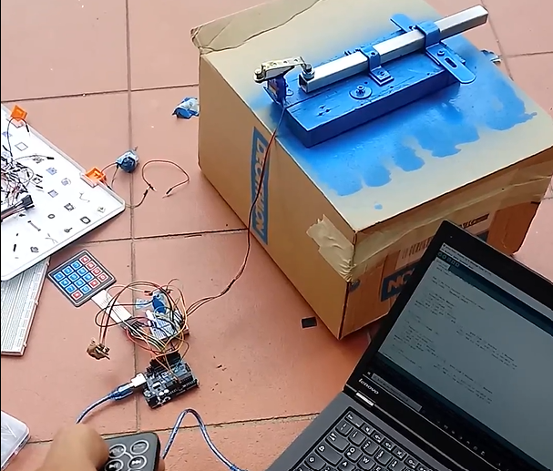
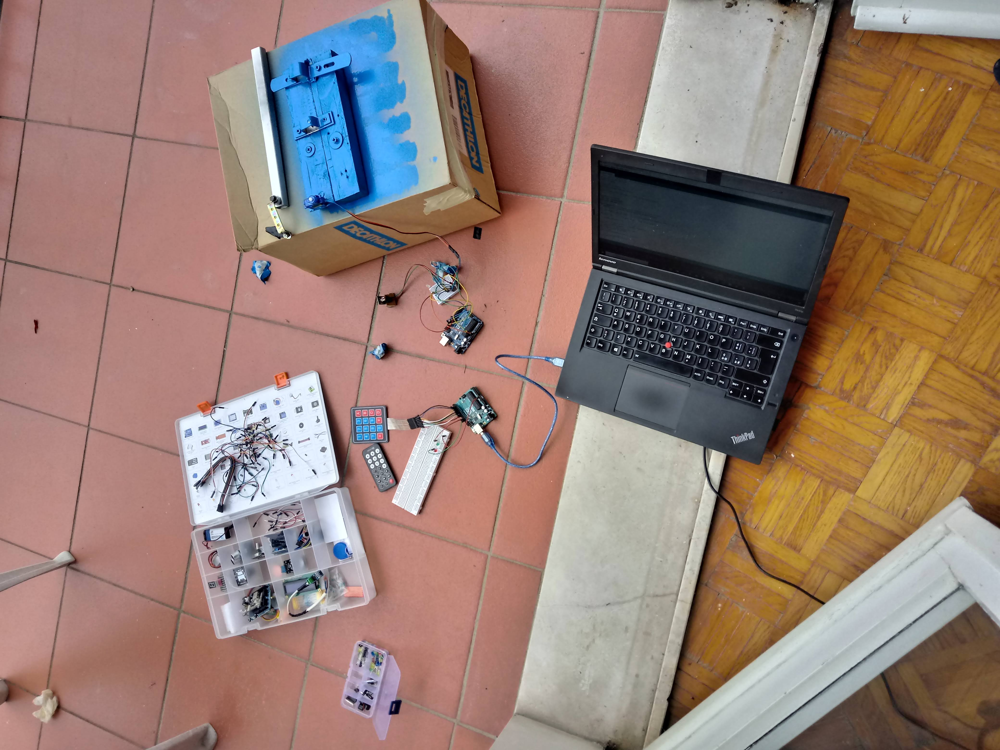

# doorlock

i created an Arduino-based door lock with IR remote and servo

You can found the code on

    sketchlock/sketchlock.ino
   or  under the next photos:

some random photos:

    #include <Servo.h>
     #include <IRremote.h>

    Servo myservo;  // create servo object to control a servo
       // twelve servo objects can be created on most boards

    int receiver = 12; // Signal Pin of IR receiver to Arduino Digital Pin 6

    int pos = 0;    // variable to store the servo position

    IRrecv irrecv(receiver);    // create instance of 'irrecv'
      decode_results results;     // create instance of 'decode_results'

    void setup()
          {
            irrecv.enableIRIn(); // Start the receiver
            myservo.attach(9);  // attaches the servo on pin 9 to the servo object
          }

    void loop()
         {
           if (irrecv.decode(&results)) // have we received an IR signal?

    {
      switch(results.value)

    {

    case 0xFFA857: // VOL+ button pressed
     for (pos = 0; pos <= 190; pos += 1) { // goes from 0 degrees to 180 degrees
    // in steps of 1 degree
    myservo.write(pos);              // tell servo to go to position in variable 'pos'
    delay(2);                       // waits 15ms for the servo to reach the position
      }
                      break;

    case 0xFF629D: // VOL- button pressed
                      for (pos = 190; pos >= 0; pos -= 1) { // goes from 180 degrees to 0 degrees
    myservo.write(pos);              // tell servo to go to position in variable 'pos'
    delay(2);                       // waits 15ms for the servo to reach the position
      }
                       break;

    }

    irrecv.resume(); // receive the next value

    }

    }/* --end main loop -- */

# DoorLock

---

<!-- DoorLock -->

  

  
  

  
  

Creazione di una ressatura comandata a distanza e con codice per uso da esterno.

<h3>
Idea
</h3>

L'idea che ha portato allo sviluppo di questo progetto nasce dal bisogno di privacy all'interno dell'ambienete salingo-familiare di un adolescente costretto in casa causa pandemia. Dopo un primo prototipo che presentava solo un telecomando per l'uso esclusivo dall'interno della camera, ho sviluppato la versione 2.0 che integra un tastierino alfanumerico con codice di apertura e chiusura della serratura.

`<b>`Questo progetto è stato sviluppato con Arduino UNO.

### Requisiti

* [Arduino UNO](https://store.arduino.cc/products/arduino-uno-rev3/?gclid=CjwKCAjwu_mSBhAYEiwA5BBmfzp4Z7FV9Xkv9bR1DVmGratKpdKqtsU9CsqWoFik-hIbw-bq4-B6MhoCt4oQAvD_BwE)
* Servo motore
* Tastierino alfanumerico
* 3x led rosso, verde, bianco
* cablaggio vario
* Arduino IDE + librerie

### Features

- Apertura/chiusura a distanda
- Apertura/chiusura con tastierino
- Led x illminazione notturna
- Led x conferma o errore codice

<h3 align="center">
:: Workflow ::
</h3>

### Find Me on :

  
  

